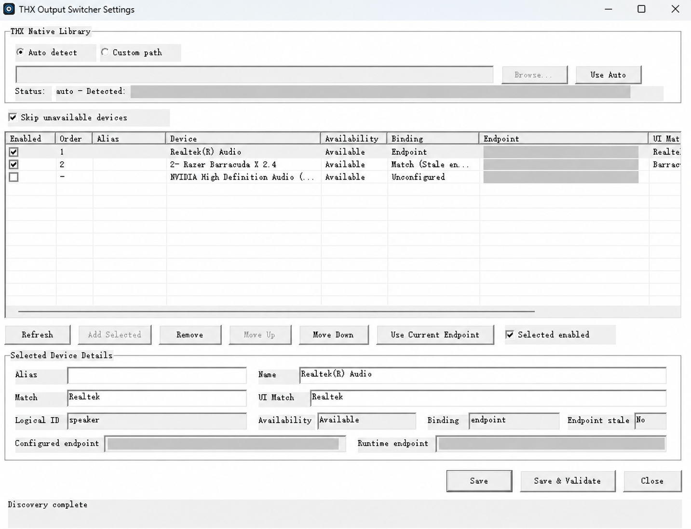
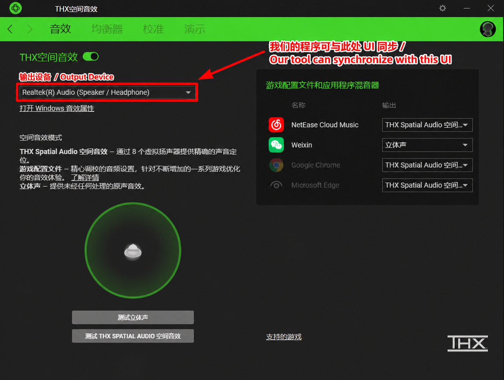

# Razer THX Output Switcher

**非官方 Razer THX Spatial Audio 输出设备切换工具**

**An unofficial output device switcher for Razer THX Spatial Audio.**

---

## 🇨🇳 中文介绍

### 项目简介

Razer THX Output Switcher 是一款适用于 Windows 的轻量级工具，用于快速切换 Razer THX Spatial Audio 所使用的物理音频输出设备。

用户可以预先配置多个输出设备及其切换顺序，每次运行程序即可自动切换至下一个设备，无需反复进入 Razer 软件手动选择。

例如：

**扬声器 → 无线耳机 → 其他输出设备 → 扬声器 → ……**

### 主要功能

- **一键轮转切换：** 每次运行切换程序，按预设顺序切换至下一个输出设备；到达列表末尾后自动从头循环。
- **多设备自由配置：** 支持选择参与轮转的音频设备，自定义启用状态及切换顺序。
- **自动跳过不可用设备：** 可选择跳过当前不可用的设备，避免切换至无法使用的输出。
- **THX 物理输出切换：** 直接切换 THX Spatial Audio 使用的物理音频输出设备，无需手动进入 Razer 软件操作。
- **保持 Windows 默认输出：** 正常切换过程中，保持 THX Spatial Audio 为 Windows 默认播放设备。
- **THX 界面同步：** 当 THX 软件界面可访问时，可将界面中的输出设备选择同步至实际切换结果。
- **图形化设备管理：** 提供独立的 Settings 程序，支持设备发现、配置编辑、顺序调整及保存验证。
- **安全匹配机制：** 当设备身份存在歧义或配置验证失败时，采用失败关闭机制，避免任意选择错误设备。

### 系统要求

- 64 位 Windows 系统。
- 已安装且能够正常工作的 Razer THX Spatial Audio 及其相关软件。
- 至少两个兼容的物理音频输出设备。

### 下载与使用

1. 前往本仓库的 **Releases** 页面，下载最新 Windows ZIP 压缩包。
2. 将压缩包完整解压至一个固定文件夹。
3. 运行 `THX_Output_Switcher_Settings.exe`。
4. 选择需要参与切换的设备，调整启用状态和切换顺序。
5. 点击 **Save & Validate**，保存并验证配置。
6. 运行 `THX_Output_Switcher.exe`，即可按预设顺序切换至下一个音频输出设备。

每运行一次切换程序，轮转一次。

请保留完整的解压目录结构，不要单独移动 EXE 文件或删除 `components` 文件夹。

### 当前版本

**v0.9.0-rc.1**

当前为候选版本，可能存在尚未发现的兼容性问题。不同 Razer 软件版本及音频设备环境下的实际表现可能有所差异。

---

## 🇬🇧 English

### Overview

Razer THX Output Switcher is a lightweight Windows utility designed to quickly switch the physical audio output device used by Razer THX Spatial Audio.

Users can configure multiple output devices and customize their switching order. Each invocation automatically selects the next device, eliminating the need to repeatedly change the output manually in the Razer application.

For example:

**Speakers → Wireless Headphones → Another Output Device → Speakers → …**

### Features

- **One-Click Device Cycling:** Each invocation switches to the next device in the configured order. Cycling automatically returns to the beginning after reaching the end of the list.
- **Flexible Multi-Device Configuration:** Select participating audio devices and customize their enabled states and switching order.
- **Skip Unavailable Devices:** Optionally skip currently unavailable devices to avoid switching to an unusable output.
- **THX Physical Output Switching:** Directly switch the physical audio output device used by THX Spatial Audio without manually operating the Razer application.
- **Preserve Windows Default Output:** Keep THX Spatial Audio as the Windows default playback device during normal switching.
- **THX UI Synchronization:** When the THX application interface is accessible, synchronize its displayed output-device selection with the actual switching result.
- **Graphical Device Management:** Use the standalone Settings application to discover devices, edit configurations, adjust their order, and save and validate settings.
- **Fail-Closed Device Matching:** Avoid arbitrarily selecting an incorrect device when device identity is ambiguous or configuration validation fails.

### System Requirements

- 64-bit Windows.
- A properly installed and functioning Razer THX Spatial Audio environment.
- At least two compatible physical audio output devices.

### Download and Usage

1. Visit the repository's **Releases** page and download the latest Windows ZIP archive.
2. Fully extract the archive to a permanent folder.
3. Run `THX_Output_Switcher_Settings.exe`.
4. Select the devices to include in cycling and configure their enabled states and switching order.
5. Click **Save & Validate** to save and validate the configuration.
6. Run `THX_Output_Switcher.exe` to switch to the next configured audio output device.

Each invocation advances the device cycle by one step.

Keep the complete extracted directory structure intact. Do not move the executable files individually or remove the `components` folder.

### Current Version

**v0.9.0-rc.1**

This is a release candidate and may contain undiscovered compatibility issues. Actual behavior may vary depending on the Razer software version and audio hardware configuration.

---

## 🖼️ 界面展示 / UI Preview

### 1. 本工具设置界面 / Tool Settings

通过图形化界面管理参与轮转切换的音频设备，包括设备启用状态、切换顺序及配置验证。

Manage audio devices through a graphical interface, including enabled states, cycling order, and configuration validation.

*注：图片经过隐私处理及视觉编辑，仅供界面展示。*

*Note: This image has been privacy-redacted and visually edited for illustration purposes.*

### 2. THX 输出设备界面同步 / THX Output Device UI Synchronization

本工具切换 THX Spatial Audio 使用的物理输出设备后，在 THX 软件界面可访问的情况下，可将输出设备下拉框同步至当前选择的设备。

After switching the physical output device used by THX Spatial Audio, the tool can synchronize the output-device dropdown in the THX application when its interface is accessible.

*注：图片经过标注及视觉编辑，仅用于功能说明。界面同步取决于 THX 软件的可访问状态及兼容性。*

*Note: This annotated and visually edited image illustrates the feature. UI synchronization depends on the THX application's accessibility and compatibility.*

---
## ❤️ 自愿赞赏 / Support This Project

如果这个工具为你节省了时间，欢迎通过微信赞赏或支付宝自愿支持项目开发与维护。

赞赏完全自愿，不影响软件的下载、使用或功能，也不代表购买技术支持服务。感谢你的支持！

If this utility saves you time, you are welcome to support its development and maintenance through WeChat or Alipay.

Support is entirely optional. It is not required to download or use the software, does not unlock additional features, and does not constitute the purchase of technical support. Thank you for your support!

### 微信赞赏 / WeChat

### 支付宝 / Alipay

---
## 📄 许可证 / License

本项目采用 Apache License 2.0，具体条款请参阅仓库中的 `LICENSE` 文件。`LICENSE.zh-CN.md` 为非官方中文译文，`NOTICE` 包含相关声明。

目前公开提供编译后的 Windows 应用程序，不主动公开完整 C++ 源代码。

This project is licensed under the Apache License 2.0. See `LICENSE` for the authoritative terms, `LICENSE.zh-CN.md` for an unofficial Chinese translation, and `NOTICE` for attribution information.

Currently, the compiled Windows application is publicly distributed, while the complete C++ source code is not published.

---

## 免责声明 / Disclaimer

本项目为独立开发的非官方第三方工具，与 Razer 或 THX 官方没有隶属、合作、赞助或认可关系。

Razer 和 THX 相关名称及商标归其各自权利人所有。

本工具依赖用户自行安装的 Razer THX 软件。开发者不保证其兼容所有软件版本和音频设备。

This is an independently developed, unofficial third-party project. It is not affiliated with, endorsed by, sponsored by, or officially associated with Razer or THX.

All respective trademarks belong to their owners.

This utility relies on the user's existing Razer THX software installation. Compatibility with every software version and audio device is not guaranteed.
